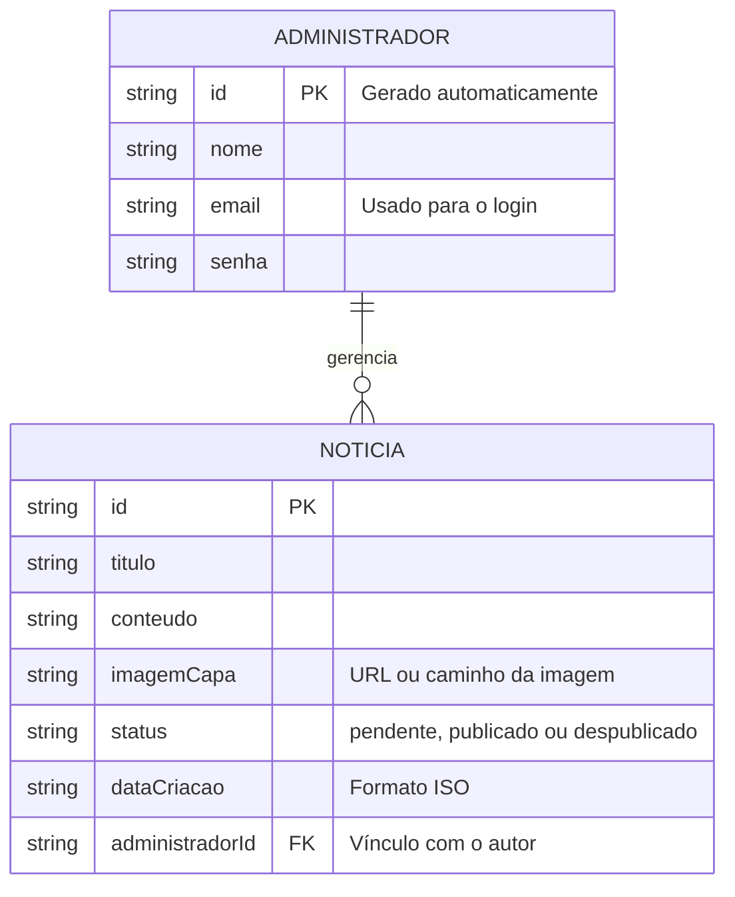

# 🛠️ Especificação Técnica (Tech Spec) - Jornal Tech

Este documento detalha a arquitetura técnica, o modelo de dados e os contratos de API (via JSON Server) necessários para a aplicação Jornal Tech.

## 1. Modelo de Dados (Diagrama ER)

Abaixo está o Diagrama Entidade-Relacionamento (DER) que representa a estrutura de dados que será simulada em nosso `db.json`.

## 2. Dicionário de Dados

Breve explicação das entidades:

- **Administradores:** Armazena os dados dos jornalistas e editores que possuem acesso ao painel de controle.
  - `id`: Identificador único.
  - `email`: Chave de acesso ao painel.
  - `senha`: Senha de acesso.
  
- **Noticias:** Representa as matérias que serão exibidas (ou não) na página principal e de leitura.
  - `id`: Identificador da matéria.
  - `titulo` e `conteudo`: Textos da matéria.
  - `imagemCapa`: Referência visual da notícia.
  - `status`: Campo vital que dita a regra de negócio. O front-end da página pública deve fazer um `GET` filtrando apenas as notícias com `status="publicado"`.
  - `administradorId`: Chave estrangeira que indica quem criou a matéria.

## 3. Rotas da API (JSON Server)

A aplicação utilizará o JSON Server para simular o backend. Abaixo as principais rotas planejadas:

- **Notícias**
  - `GET /noticias`: Retorna a lista de todas as notícias (Usado no painel administrativo).
  - `GET /noticias?status=publicado`: Retorna apenas as notícias publicadas (Usado na home pública e carrossel).
  - `GET /noticias/:id`: Retorna os detalhes de uma notícia específica (Página da Notícia).
  - `POST /noticias`: Cria uma nova notícia (com status `pendente`).
  - `PUT /noticias/:id`: Atualiza dados de uma notícia existente (ou altera o `status` para Publicar/Despublicar).
  - `DELETE /noticias/:id`: Remove a matéria.

- **Administradores (Autenticação Simulada)**
  - `GET /administradores?email={email}&senha={senha}`: Endpoint que será usado pela página de login para validar credenciais.

## 4. Integração de API Externa

Além da API fake local, o portal consumirá uma **API Pública Real** para mostrar cotações de criptomoedas, preenchendo o requisito de exibição de dados financeiros no Header.
- **Exemplo de API:** CoinGecko API ou equivalente para resgatar cotações atuais (ex: `/simple/price?ids=bitcoin,ethereum&vs_currencies=brl`).
